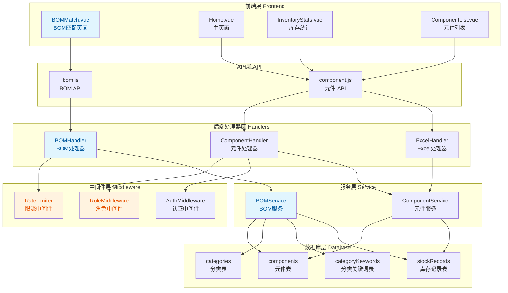
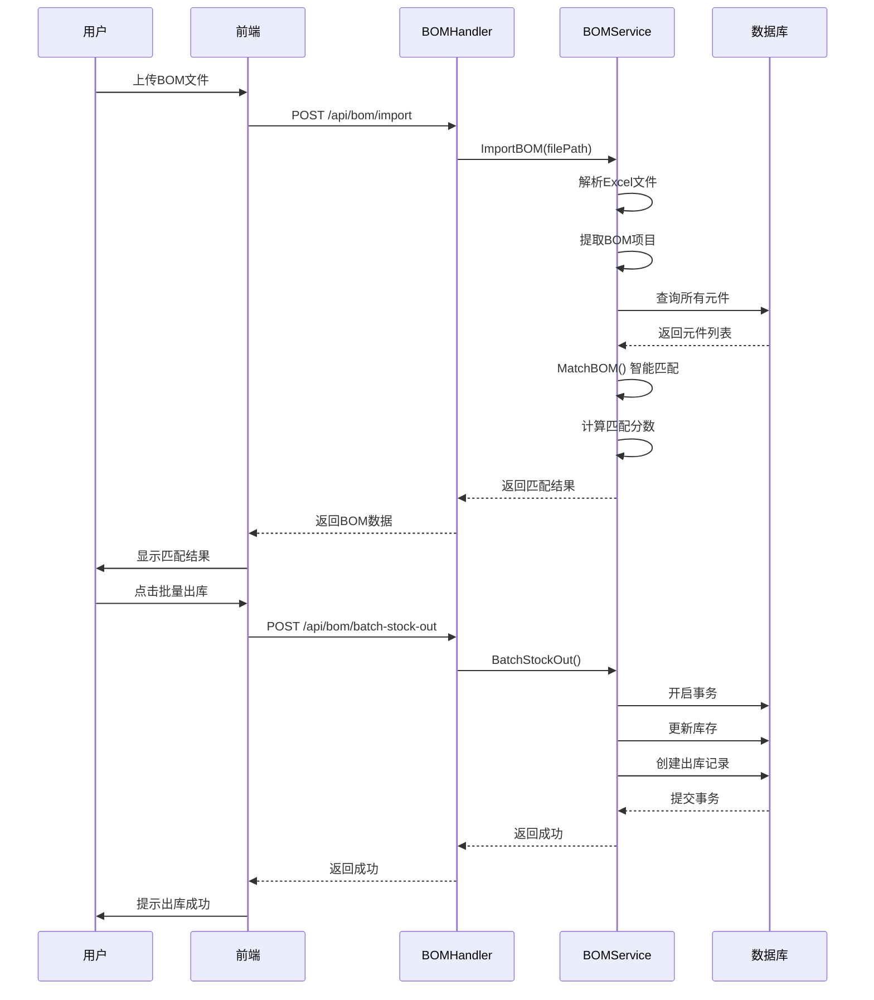

**影响范围：** 🔴 **高** - 新增完整的BOM智能匹配模块，增强系统安全性和响应式设计

**核心变更：**

* ✨ **新增BOM智能匹配功能** - 支持上传BOM文件、自动匹配库存、批量出库

* 🔒 **安全增强** - 添加限流中间件（登录接口）、角色权限控制（用户管理仅admin可访问）

* 📊 **数据库优化** - 添加分类字段和索引、新增分类表和分类关键词表

* 📱 **响应式设计** - 前端全面支持移动端适配

* 🛠️ **工具改进** - 统一错误响应、添加健康检查、改进Excel导出功能

***

## 2. 可视化概览 (代码与逻辑映射)



**BOM匹配核心流程：**



***

## 3. 详细变更分析

### 🆕 3.1 BOM智能匹配模块 (新增功能)

#### 后端实现

**文件：** `backend/internal/handlers/bom.go` (新增)

**核心功能：**

* `ImportBOM()` - 导入BOM文件并自动匹配库存

* `BatchStockOut()` - 批量出库操作

* `ExportBOM()` - 导出BOM匹配结果

**文件：** `backend/internal/service/bom.go` (新增)

**核心逻辑：**

* `ImportBOM()` - 解析Excel文件，提取Comment、Footprint、Quantity等字段

* `MatchBOM()` - 智能匹配算法，基于Comment、Footprint、Model、Parameters计算匹配分数

* `calculateMatchScore()` - 匹配分数计算：

  * Comment匹配：+30分

  * Footprint匹配：+25分

  * Model匹配：+25分

  * Parameters匹配：+20分

  * 分数阈值：>50分才算匹配成功

**文件：** `backend/main.go`

**路由配置：**

```go
// BOM 路由
bom := protected.Group("/bom")
{
    bom.POST("/import", bomHandler.ImportBOM)
    bom.POST("/batch-stock-out", bomHandler.BatchStockOut)
    bom.POST("/export", bomHandler.ExportBOM)
}
```

#### 前端实现

**文件：** `frontend/src/views/BOMMatch.vue` (新增)

**功能特性：**

* 拖拽上传BOM文件（支持.xlsx、.xls格式）

* 实时显示匹配结果（匹配/未匹配状态）

* 显示匹配分数和库存信息

* 支持批量出库和单个出库

* 导出匹配结果为Excel

* 响应式设计，支持移动端

**文件：** `frontend/src/api/bom.js` (新增)

**API接口：**

```javascript
uploadBOM(formData)           // 上传BOM文件
batchStockOut(batchData)      // 批量出库
stockOut(componentId, data)   // 单个出库
exportBOM(data)               // 导出BOM结果
```

***

### 🔒 3.2 安全增强

#### 限流中间件

**文件：** `backend/internal/middleware/rate_limit.go` (新增)

**实现机制：**

* 基于内存的令牌桶算法

* 按IP地址限流

* 时间窗口内限制请求数

* 自动清理过期记录

**配置：** `backend/main.go`

```go
rateLimiter := middleware.NewRateLimiter(10, time.Minute) // 每分钟10个请求
api.POST("/auth/login", rateLimiter.Limit(), userHandler.Login)
```

#### 角色权限控制

**文件：** `backend/internal/middleware/role.go` (新增)

**实现机制：**

* 基于角色的访问控制（RBAC）

* 从上下文获取用户角色

* 检查角色是否在允许列表中

**配置：** `backend/main.go`

```go
users := protected.Group("/users")
users.Use(middleware.RoleMiddleware("admin")) // 只允许admin角色访问
{
    users.GET("", userHandler.GetList)
    users.POST("", userHandler.Create)
    // ...
}
```

#### 文件上传安全

**文件：** `backend/internal/handlers/excel.go`

**安全改进：**

* 限制文件大小为10MB

* 验证文件类型（仅支持.xlsx、.xls）

```go
c.Request.Body = http.MaxBytesReader(c.Writer, c.Request.Body, 10<<20) // 10MB
ext := header.Filename[len(header.Filename)-4:]
if ext != ".xlsx" && ext != ".xls" {
    c.JSON(http.StatusBadRequest, gin.H{"error": "只支持Excel文件(.xlsx, .xls)"})
    return
}
```

***

### 📊 3.3 数据库优化

#### Schema变更

**文件：** `backend/schema.sql`

**新增字段：**

```sql
ALTER TABLE components ADD COLUMN `category` varchar(100) NOT NULL COMMENT '分类';
```

**新增索引：**

```sql
KEY `idx_productCode` (`productCode`),
KEY `idx_brand` (`brand`),
KEY `idx_category` (`category`),
KEY `idx_model` (`model`),
KEY `idx_name` (`name`),
KEY `idx_currentStock` (`currentStock`)
```

**新增表：**

| 表名                 | 用途     | 关键字段                           |
| ------------------ | ------ | ------------------------------ |
| `categories`       | 分类表    | id, name, createdAt, updatedAt |
| `categoryKeywords` | 分类关键词表 | id, categoryId, keyword        |

**外键约束：**

```sql
CONSTRAINT `fk_categoryKeywords_categoryId` 
FOREIGN KEY (`categoryId`) REFERENCES `categories` (`id`) 
ON DELETE CASCADE ON UPDATE CASCADE
```

***

### 📱 3.4 前端响应式设计

#### 主页面改进

**文件：** `frontend/src/views/Home.vue`

**主要变更：**

* 将侧边栏改为抽屉式菜单（移动端友好）

* 添加BOM匹配菜单项

* 改进Excel导出功能（使用前端xlsx库）

* 添加视图状态持久化（localStorage）

* 添加category字段到表单和表格

**导出功能增强：**

```javascript
// 使用前端xlsx库导出，支持更多自定义选项
const wb = XLSX.utils.book_new()
const ws = XLSX.utils.json_to_sheet(exportData)
ws['!cols'] = columnWidths  // 设置列宽
XLSX.writeFile(wb, `元件清单-${timeString}.xlsx`)
```

#### 库存统计改进

**文件：** `frontend/src/views/InventoryStats.vue`

**分类体系扩展：**
从4个分类扩展到14个分类：

* 电容/电阻/电感

* 微控制器/逻辑器件

* 二极管/晶体管

* 板级电路保护/电源管理

* 接口芯片/时钟和计时

* 连接器/端子/开关

* 数据转换芯片/射频无线

* 光电器件/显示模块

* 滤波器/晶体/振荡器

* 存储器/传感器/隔离器件

* 继电器/蜂鸣器/马达

* 功能模块/通信模块

* 放大器/开发板

* 工具/仪器仪表/耗材

#### 元件列表改进

**文件：** `frontend/src/views/components/ComponentList.vue`

**响应式优化：**

* 添加表格容器滚动支持

* 移动端隐藏部分列

* 调整分页器布局

* 优化按钮和输入框尺寸

***

### 🛠️ 3.5 工具与基础设施

#### 统一错误响应

**文件：** `backend/internal/utils/error.go` (新增)

**响应结构：**

```go
type ErrorResponse struct {
    Code    int    `json:"code"`
    Message string `json:"error"`
}

type SuccessResponse struct {
    Message string      `json:"message"`
    Data    interface{} `json:"data,omitempty"`
}
```

**使用示例：**

```go
utils.RespondWithError(c, http.StatusBadRequest, "Invalid request")
utils.RespondWithSuccess(c, "操作成功", data)
```

#### 日志增强

**文件：** `backend/internal/handlers/component.go`

**添加操作日志：**

```go
// 记录创建操作日志
if logger != nil {
    logger.Info("Component created",
        zap.Uint("id", component.ID),
        zap.String("productCode", component.ProductCode),
        zap.String("name", component.Name),
    )
}
```

#### Docker健康检查

**文件：** `Dockerfile`

```dockerfile
HEALTHCHECK --interval=30s --timeout=10s --start-period=60s --retries=3 \
  CMD curl -f http://localhost:8080/api/components || exit 1
```

**文件：** `start.sh`

```bash
# 安装curl用于健康检查
apk add --no-cache curl
```

#### 配置调整

**文件：** `backend/config.yaml`

```yaml
database:
  host: localhost  # 从mysql改为localhost
```

**文件：** `docker-compose.yml`

```yaml
mysql:
  image: mysql:8.0.45  # 从8.1.0降级到8.0.45
```

**文件：** `frontend/package.json`

```json
{
  "dependencies": {
    "xlsx": "^0.18.5"  // 新增xlsx库
  }
}
```

***

## 4. 影响与风险评估

### ⚠️ 破坏性变更

| 变更项         | 影响范围                         | 风险等级 | 说明                           |
| ----------- | ---------------------------- | ---- | ---------------------------- |
| 数据库Schema变更 | components表                  | 🔴 高 | 需要执行migration添加category字段和索引 |
| 新增表         | categories, categoryKeywords | 🟡 中 | 需要创建新表                       |
| MySQL版本降级   | 8.1.0 → 8.0.45               | 🟡 中 | 可能存在兼容性问题                    |
| API响应格式变更   | 所有接口                         | 🟢 低 | 统一错误响应格式，前端需适配               |

### 🧪 测试建议

#### 功能测试

1. **BOM匹配功能**

   * 测试上传不同格式的BOM文件

   * 验证匹配算法准确性

   * 测试批量出库功能

   * 测试导出功能

2. **安全功能**

   * 测试限流中间件（快速连续登录）

   * 测试角色权限控制（非admin用户访问用户管理）

   * 测试文件上传大小限制

   * 测试文件类型验证

3. **数据库**

   * 验证索引是否正确创建

   * 验证外键约束是否生效

   * 测试分类相关查询性能

#### 性能测试

1. **BOM匹配性能**

   * 测试大文件（1000+行）的匹配速度

   * 测试并发上传场景

2. **限流测试**

   * 验证限流是否生效

   * 测试限流后的恢复

#### 兼容性测试

1. **浏览器兼容性**

   * 测试移动端响应式布局

   * 测试不同浏览器的文件上传

2. **MySQL版本兼容性**

   * 验证8.0.45版本的功能是否正常

### 📋 部署注意事项

1. **数据库迁移**

   ```sql
   -- 添加category字段
   ALTER TABLE components ADD COLUMN `category` varchar(100) NOT NULL COMMENT '分类';

   -- 添加索引
   ALTER TABLE components ADD KEY `idx_productCode` (`productCode`);
   ALTER TABLE components ADD KEY `idx_brand` (`brand`);
   ALTER TABLE components ADD KEY `idx_category` (`category`);
   ALTER TABLE components ADD KEY `idx_model` (`model`);
   ALTER TABLE components ADD KEY `idx_name` (`name`);
   ALTER TABLE components ADD KEY `idx_currentStock` (`currentStock`);

   -- 创建分类表
   CREATE TABLE `categories` (
     `id` bigint unsigned NOT NULL AUTO_INCREMENT,
     `name` varchar(100) NOT NULL COMMENT '分类名称',
     `createdAt` datetime(3) DEFAULT NULL,
     `updatedAt` datetime(3) DEFAULT NULL,
     PRIMARY KEY (`id`),
     UNIQUE KEY `idx_name` (`name`)
   ) ENGINE=InnoDB DEFAULT CHARSET=utf8mb4 COLLATE=utf8mb4_unicode_ci;

   -- 创建分类关键词表
   CREATE TABLE `categoryKeywords` (
     `id` bigint unsigned NOT NULL AUTO_INCREMENT,
     `categoryId` bigint unsigned NOT NULL COMMENT '分类ID',
     `keyword` varchar(100) NOT NULL COMMENT '关键词',
     `createdAt` datetime(3) DEFAULT NULL,
     `updatedAt` datetime(3) DEFAULT NULL,
     PRIMARY KEY (`id`),
     KEY `idx_categoryId` (`categoryId`),
     CONSTRAINT `fk_categoryKeywords_categoryId` FOREIGN KEY (`categoryId`) REFERENCES `categories` (`id`) ON DELETE CASCADE ON UPDATE CASCADE
   ) ENGINE=InnoDB DEFAULT CHARSET=utf8mb4 COLLATE=utf8mb4_unicode_ci;
   ```

2. **环境变量**

   * 确认数据库主机配置（localhost vs mysql）

   * 确认MySQL版本兼容性

3. **前端依赖**

   ```bash
   cd frontend
   npm install
   ```

4. **Docker镜像**

   ```bash
   docker-compose down
   docker-compose build
   docker-compose up -d
   ```

***

## 5. 总结

本次变更是一个**功能丰富且影响广泛**的更新，主要包括：

✅ **新增BOM智能匹配模块** - 完整的前后端实现，支持文件上传、智能匹配、批量出库\
✅ **安全增强** - 限流中间件、角色权限控制、文件上传安全验证\
✅ **数据库优化** - 添加分类字段、索引优化、新增分类表\
✅ **用户体验改进** - 响应式设计、统一错误响应、操作日志记录\
✅ **基础设施完善** - Docker健康检查、配置调整

**建议优先级：**

1. 🔴 **高优先级** - 数据库迁移、BOM功能测试
2. 🟡 **中优先级** - 安全功能测试、性能测试
3. 🟢 **低优先级** - UI细节优化、文档更新

**总体评价：** 代码质量良好，架构清晰，功能完整，建议在测试环境充分验证后部署到生产环境。
